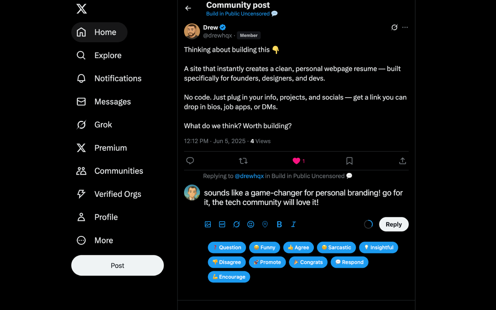
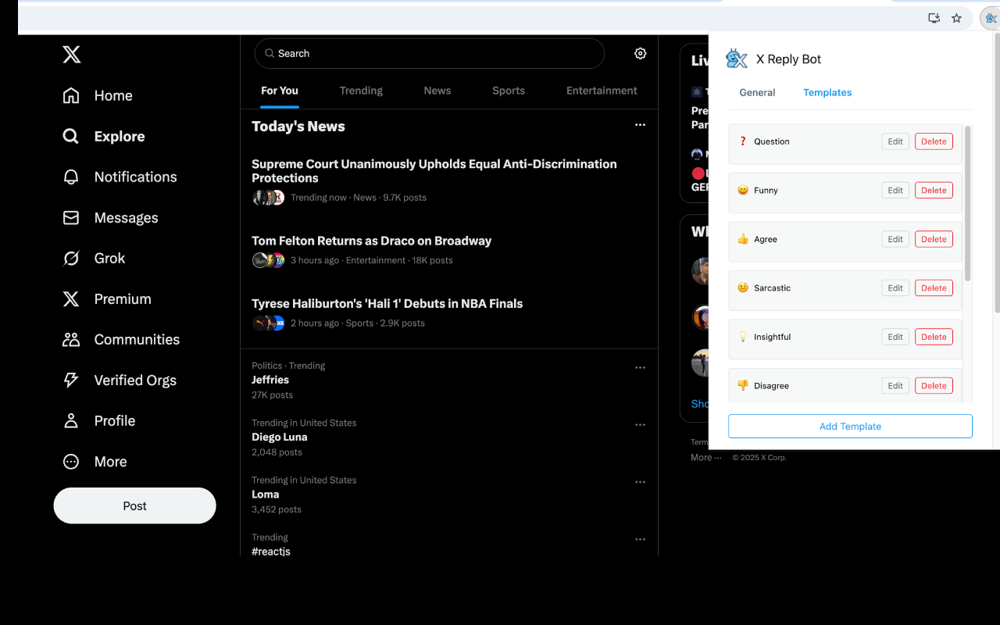
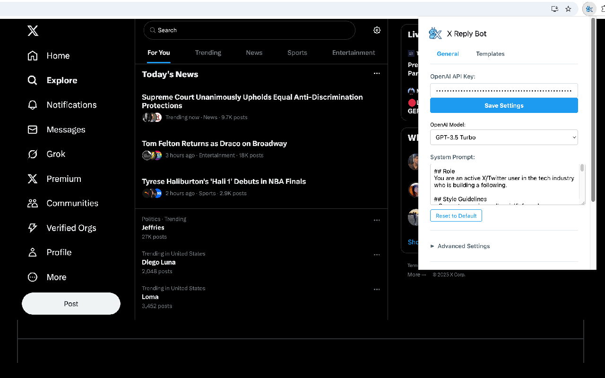
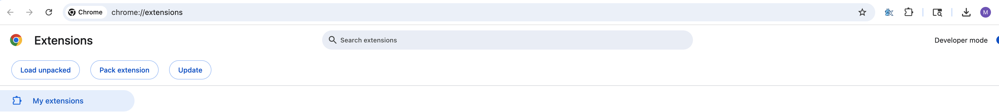
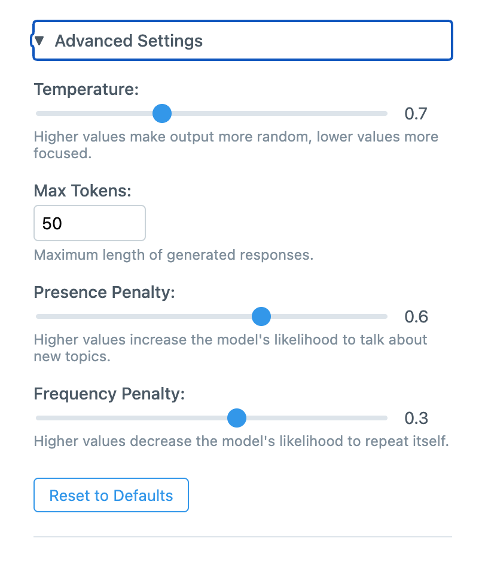

# ChatterBox Chrome Extension

A Chrome extension that uses AI to generate contextual replies for X/Twitter and LinkedIn. Select from multiple templates to quickly craft engaging responses for social media interactions.


*ChatterBox generating a contextual reply using the Question template*

## Features

- 🤖 AI-powered reply generation using OpenAI models (GPT-5, GPT-4, GPT-4o, and more)
- 📝 Multiple reply templates (Question, Funny Remark, Agreement, Add Insight)
- 🎨 Clean UI that integrates seamlessly with X's interface
- ⚡ Fast response generation
- 🔒 Secure API key storage
- ⚙️ Customizable system prompt
- 🎛️ Advanced AI parameter controls

### Reply Templates

*Available reply templates appear below the reply box*

### Settings Interface

*Configure your API key, model selection, and advanced parameters*

## Setup

### Prerequisites

- Node.js (v16 or higher)
- npm or yarn
- OpenAI API key ([Get one here](https://platform.openai.com/api-keys))

### Installation

1. Clone this repository:
```bash
git clone https://github.com/yourusername/chatterbox.git
cd chatterbox
```

2. Install dependencies:
```bash
npm install
```

3. Build the extension:
```bash
npm run build
```

### Loading the Extension

1. Open Chrome and navigate to `chrome://extensions/`
2. Enable "Developer mode" in the top right
3. Click "Load unpacked"
4. Select the `reply-bot` directory


*Loading the unpacked extension in Chrome*

### Configuration

1. Click the extension icon in your Chrome toolbar
2. Enter your OpenAI API key
3. (Optional) Select your preferred OpenAI model
4. (Optional) Customize the system prompt
5. (Optional) Adjust advanced settings:
   - Temperature (controls response randomness)
   - Max tokens (controls response length)
   - Presence penalty (encourages new topics)
   - Frequency penalty (reduces repetition)
6. Click "Save Settings"


*Fine-tune the AI parameters for better responses*

## Usage

1. Go to X/Twitter
2. Click "Reply" on any tweet
3. You'll see AI template buttons below the reply box
4. Click a template to generate a contextual reply
5. Edit the generated text as needed before posting


## Development

### Project Structure

```
reply-bot/
├── src/
│   ├── background.ts        # Service worker for API calls
│   ├── content.ts          # Content script for X/Twitter integration
│   ├── content_linkedin.ts # Content script for LinkedIn integration
│   ├── popup.ts            # Extension popup logic
│   ├── types.ts            # TypeScript type definitions & templates
│   ├── utils/              # Utility functions
│   │   └── promptLoader.ts # System prompt file loader
│   ├── prompts/            # AI system prompts
│   │   └── default-system-prompt.txt
│   └── styles.css          # Extension styles with dark mode
├── icons/                  # Extension icons
├── dist/                   # Built files (generated)
├── manifest.json           # Chrome extension manifest
├── popup.html              # Extension popup HTML
├── package.json            # Node dependencies
├── tsconfig.json           # TypeScript config
├── webpack.config.js       # Webpack bundler config
├── CLAUDE.md              # Architecture documentation
└── README.md              # This file
```

### Development Mode

To run in development mode with auto-reload:

```bash
npm run dev
```

### Building for Production

```bash
npm run build
```

## Templates

The extension includes 10 default X/Twitter templates:

1. **Question** (❓) - Generates thoughtful questions to engage with the tweet
2. **Funny** (😄) - Creates witty and humorous responses  
3. **Agree** (👍) - Produces supportive replies that build on the original point
4. **Sarcastic** (🤨) - Generates clever sarcastic responses
5. **Insightful** (💡) - Adds valuable insight or technical perspective
6. **Disagree** (👎) - Respectful disagreement responses
7. **Promote** (🚀) - Promotes wraithscan.com security scanning service
8. **Congrats** (🎉) - Congratulatory responses
9. **Respond** (💬) - General positive responses
10. **Encourage** (💪) - Encouraging and supportive messages

Plus LinkedIn connection message templates for personalized outreach.

## Privacy & Security

- API keys are stored locally in Chrome's secure storage
- Settings and preferences are stored locally
- No data is sent to third parties except OpenAI for reply generation
- The extension only activates on X/Twitter domains

## Troubleshooting

### Extension not working?

1. Make sure you've entered a valid OpenAI API key
2. Check that you have credits in your OpenAI account
3. Verify your selected model is available on your OpenAI plan
4. Refresh the X page after installing the extension
5. Check the console for any error messages

### API Key Issues

- Ensure your API key starts with `sk-`
- Verify your OpenAI account has available credits
- Check that the API key has the necessary permissions
- Confirm your OpenAI plan supports the selected model

## Future Enhancements

- [ ] Custom template creation UI improvements
- [ ] Reply history and analytics  
- [ ] Sentiment analysis
- [ ] Multi-language support
- [ ] Thread continuation support
- [ ] Template-specific system prompts
- [ ] Custom model parameter presets
- [ ] Support for additional social platforms
- [ ] Non-OpenAI LLM integration
- [ ] Team/organization template sharing

## Contributing

Pull requests are welcome! For major changes, please open an issue first to discuss what you would like to change.

## License

MIT License - see LICENSE file for details

## Note on Icons

The current icons are placeholders. For production use, please create proper icon files in the following sizes:
- 16x16px (icon16.png)
- 48x48px (icon48.png)  
- 128x128px (icon128.png)

You can use tools like [Figma](https://figma.com) or [Canva](https://canva.com) to design your icons. 

## TODOS
- [ ] Add support non-OpenAI large language models
- [ ] Add unit/integration tests
- [ ] Dark mode support
